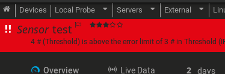
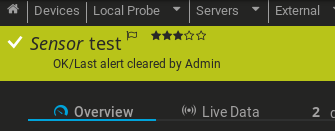
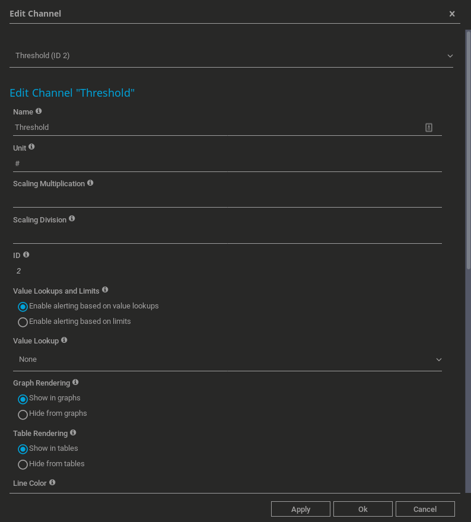
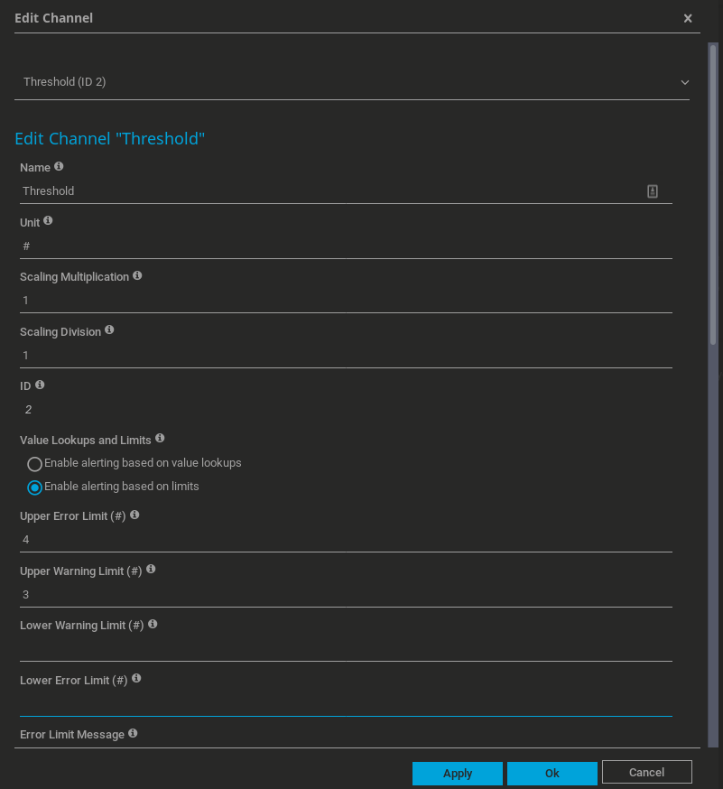

# PRTG Alert Toggle Webhook API
Utilize static error alerts for custom log behavior with PRTG's webhook API.

An alert has been triggered (which will stick around until administratively cleared)



Alert manually cleared by an Admin:



## Requirements
- GNU/Linux-based distro (Debian/Ubuntu/CentOS, etc) - may work in others, but only tested in a Linux environment
- Python 3 (3.5.3+)
- Pip3 (pre-installed on most distros)

Python Packages (installable via Pip3 / requirements.txt):
- Dataset v1.1.2+
- Stuf v0.9.16

## Setup
First, configure your sensor so you can get an API token from PRTG.
- Sensors > Add Sensor > Add/Create a Device (doesn't matter which) > fill in details > on the device > Add Sensor > HTTP Push Advanced
- Name the sensor > fill in details > method: post > create.. once created, click on the newly created channel > settings > copy/paste your token into the script's config

**If your log is not currently in DD-MMM-YYYY:HH:MM:SS format:**
- You *must* adjust the following line:
```python
visit = datetime.strptime(date_str, '%d/%b/%Y:%H:%M:%S').strftime('%Y-%m-%d %H:%M:%S')
```

- And change the date format from (**strptime** field only):
```python
%d/%b/%Y:%H:%M:%S
```

To whatever format your log uses.  [Python Date Variables](https://swalladge.github.io/strftime/)

### Install Dependencies
If on Debian:
- Pip3 should already be installed

Then, install the Toggle script's dependencies:
```bash
sudo pip3 install -r requirements.txt
```
(substitute pip3 for pip if using a distro that has Python3 set as its default Python (on Debian, it is Python2, at the time of writing.)


## To Use
- Trigger the sensor by running the script from the cli: `/path/to/script/prtg-toggle --start` or `prtg-toggle --start` if you added a symlink
- Go into channel settings and configure your thresholds.  

**Modifying the Channel Settings and Setting the Alert/Warning Thresholds** (after first webhook is triggered):



Example config:



There might be a way to send these values with the json, but I did not find any documentation to list the variables PRTG would expect.

These settings throw my channel into Warning status with a webhook call of 3+ clicks from the same IP, error status on 4+.

### Also Useful
If you want to view your databases created by this script in a GUI, try [SQLite Browser](https://sqlitebrowser.org/).


***
## Install
This script was written to work in part with an initial script that extracts only the behavioral data that's interesting, from access.log - if you point this script (PRTG Toggle) at an unmodified access log, you're going to get a lot of junk you don't care about coming through.

I've included a sample [Shell script](sample-extraction.md) you can use for testing PRTG Toggle before setting this live on your production system.

**Tell Toggle about an already processed log with activity you're interested in only, not a vanilla syslog or access log.**

- Clone to your user's home directory (the user that will be running the script)
```bash
git clone https://github.com/angela-d/prtg-toggle.git ~/prtg-toggle
```

- Best run via cron, to make toggle accessible globally, without requiring a path, add a symbolic link.  This will add a symlink to the home directory of the last non-sudo user that logged in; assuming you aren't running this as root (don't run as root):
```bash
sudo ln -s /home/$(last | grep "logged in" | grep -o '^\S*')/prtg-toggle/prtg-toggle /usr/local/bin/prtg-toggle
```

## Customizing
There are a few default configuration entries in [prtg-toggle](prtg-toggle) -- ensure you modify the options between **# start config** and **# end config** to suit your environment.

## Usage
Setup a cron that is synced with your extraction script (runs every hour at the 40-minute mark).
```bash
40 * * * * /usr/local/bin/prtg-toggle
```

## Command-Line Options

**Reset the Alarm**
Once an Admin has assessed the cause of the alarm, reset it
```bash
prtg-toggle --reset
```

**Clear the database**
Run this when your extraction log resets
```bash
prtg-toggle --clear
```

**Run the script**
Run this to start analyzing the extracted log (also is triggered by specifying no arguments)
```bash
prtg-toggle --start
```

**Help**
See available commands
```bash
prtg-toggle --help
```
